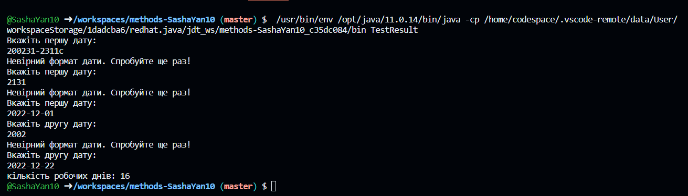

# Завдання 3 – Знайти кількість робочих днів (субота і неділя - вихідні) у проміжку між двома заданими датами.

## Код класу Exercise:
```java
//package domain;
import java.time.DayOfWeek;
import java.time.LocalDate;

public class Exercise {
    public static long Calculate(LocalDate startDate, LocalDate endDate) {
        long days = 0;
        LocalDate currenDate = startDate;

        while (!currenDate.isAfter(endDate)) { //перевірка днів у проміжку
            if (currenDate.getDayOfWeek() != DayOfWeek.SATURDAY && currenDate.getDayOfWeek() != DayOfWeek.SUNDAY) { //якщо днем не являється субота чи неділя, то збільшується кількість робочих днів
                days++;
            }

            currenDate = currenDate.plusDays(1); //перехід до наступного дня
        }

        return days;
    }
}
```

## Код класу TestResult:
```java
//package test;

//import domain.Exercise;
import java.time.LocalDate;
import java.time.format.DateTimeParseException;
import java.util.Scanner;;

public class TestResult {

    public static void main(String[] args) {
        Scanner scanner = new Scanner(System.in); // підключення об'єкту Scanner для зчитування даних, введеними
                                                  // користувачем

        LocalDate startDate = null;
        LocalDate endDate = null;

        while (startDate == null) { // перевірка на правильність вводу формати дати
            System.out.println("Вкажіть першу дату: ");
            String startDateStr = scanner.nextLine();

            try {
                startDate = LocalDate.parse(startDateStr); // якщо правильно введена дата, то рядок буде переведений в
                                                           // об'єкт LocalDate
            } catch (DateTimeParseException e) { // а якщо ні, то потрібно буде ще раз ввести дату до тих пір, поки не
                                                 // вона не буде введена правильно
                System.out.println("Невірний формат дати. Спробуйте ще раз!");
            }
        }

        while (endDate == null) {
            System.out.println("Вкажіть другу дату: ");
            String endDateStr = scanner.nextLine();

            try {
                endDate = LocalDate.parse(endDateStr);
            } catch (DateTimeParseException e) {
                System.out.println("Невірний формат дати. Спробуйте ще раз!");
            }
        }
        scanner.close();

        long days = Exercise.Calculate(startDate, endDate); // виклик функції Exercise
        System.out.println("кількість робочих днів: " + days);
    }
}
```
## Результат:


З моєї точки зору оптимальний тип даних для обсягу використовуваної пам'яті був long, оскільки він використовує 64-біти для зберігання цілих чисел.